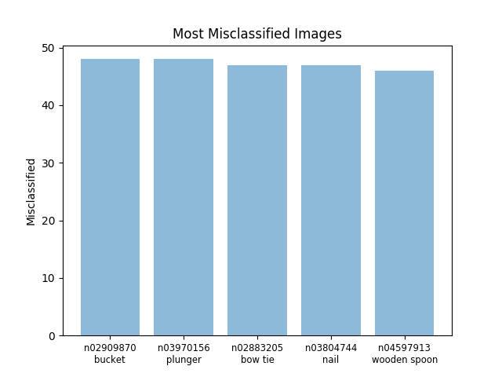

# Image Classification on Tiny ImageNet

## Download the dataset and set up virtual environment
```
bash prep.sh
```

## Usage
```
python src/main.py -h
```
```
usage: main.py [-h] [--dataset {mnist,tiny-imagenet-200}]
               [--data-dir DATA_DIR] [--batch-size BATCH_SIZE]
               [--test-batch-size TEST_BATCH_SIZE] [--epochs EPOCHS]
               [--seed SEED] [--no-cuda] [--log-interval LOG_INTERVAL]
               [--model {SVM,AlexNet}] [--ts] [--pretrained]
               [--optimizer {adam,sgd}] [--momentum MOMENTUM] [--lr LR]
               [--features FEATURES] [--classes CLASSES] [--reg]
               [--margin MARGIN] [--topk TOPK] [--results-dir RESULTS_DIR]
               [--prefix PREFIX] [--save] [--models-dir MODELS_DIR] [--load]
               [--model-path MODEL_PATH] [--err]

PyTorch Tiny ImageNet Training

optional arguments:
  -h, --help            show this help message and exit
  --dataset {mnist,tiny-imagenet-200}
                        name of dataset to train on (default: tiny-
                        imagenet-200)
  --data-dir DATA_DIR   path to dataset (default: current directory)
  --batch-size BATCH_SIZE
                        mini-batch size for training (default: 1000)
  --test-batch-size TEST_BATCH_SIZE
                        mini-batch size for testing (default: 1000)
  --epochs EPOCHS       number of total epochs to run (default: 25)
  --seed SEED           seed for initializing training (default: 1)
  --no-cuda             run without cuda (default: False)
  --log-interval LOG_INTERVAL
                        batches to wait before logging detailed status
                        (default: 100)
  --model {SVM,AlexNet}
                        model to train (default: AlexNet)
  --ts                  data augmentation using torchsample (default: False)
  --pretrained          use pretrained AlexNet model (default: False)
  --optimizer {adam,sgd}
                        optimizer (default: adam)
  --momentum MOMENTUM   momentum (default: 0.5)
  --lr LR               learning rate (default: 0.01)
  --features FEATURES   number of input features to SVM (default: 12288)
  --classes CLASSES     number of output classes of SVM (default: 200)
  --reg                 add L2 regularization for hinge loss (default: False)
  --margin MARGIN       margin for computing hinge loss (default: 20)
  --topk TOPK           top-k accuracy (default: 1)
  --results-dir RESULTS_DIR
                        path to plots (default: cwd/results)
  --prefix PREFIX       prefix of the plot (default: default)
  --save                save model (default: False)
  --models-dir MODELS_DIR
                        path to save model (default: cwd/models)
  --load                load model (default: False)
  --model-path MODEL_PATH
                        path to load model (default: cwd/models/default.pt)
  --err                 plot error analysis graphs (default: False)
```

## Examples
### Train AlexNet from scratch
__Optional parameters__: add prefix to plots; save model; plot [error analysis](#2.-2.-4-error-analysis)
```
python src/main.py --prefix top1_default --save --err
```
### Train AlexNet on pretrained model
__Optional parameters__: use pretrained model; add prefix to plots; compute top-5 accuracy; set epoch
```
python src/main.py --pretrained --prefix top5_pretrained --topk 5 --epochs 15
```
### Load a model and plot error analysis
__Optional parameters__: load model; set epoch (test without further training); plot [error analysis](#2.-2.-4-error-analysis)
```
python src/main.py --load --model-path models/top1_default_tiny-imagenet-200_AlexNet_model.pt --epoch 0 --err
```

## 1. Dataset
### 1. 1 Tiny ImageNet
Tiny ImageNet Challenge is the default course project for Stanford CS231N. It runs similar to the ImageNet challenge (ILSVRC). Tiny ImageNet has __200 classes__ and each class has __500 training images__, __50 validation images__, and __50 test images__. The images are down-sampled to __64 x 64__ pixels.  

Since the test images are not labeled, I use the validation set as test set to evaluate the models.

### 1. 2 Mnist
Mnist is also used here as a way of evaluating and testing models.

## 2. Models
It's always a good idea to start off with a simple architecture.

### 2. 1 Multi-Class SVM
#### 2. 1. 1 Structure
The SVM model contains a single linear layer that maps input images to label scores. For the sake of linear mapping, each __64 x 64 x 3__ image (RGB) in Tiny ImageNet is stretched to a single column and matrix multiplication is performed to get the score of each class.

#### 2. 1. 2 Loss function
To measure the quality of the model, we use one of the most common loss functions for Multi-Class SVM: hinge loss. Its objective is for the correct class of each image to have a predicted score that is higher than the incorrect classes by a fixed 'margin'.  

For each sample image, given:  
  -  (a vector of  values)
  - label 

We can define the loss function as:  
  - 

Where  and ,  is an integer usually set to  or . Basic hinge loss has  while squared hinge loss, another commonly used loss function that has a stronger penalty for samples that violate margins, has .  

It's also normal to add regularization to the loss function so that the loss function can be based on both data and weights. But in this case, SVM has already struggled to fit the training data as a linear classifier, adding regularization only results in lower accuracy.

#### 2. 1. 3 Performance
The SVM model can reach __6%__ top-1 accuracy and __18%__ top-5 accuracy.

### 2. 2 AlexNet
#### 2. 2. 1 Structure
AlexNet contains eight layers: the first five layers are convolutional layers followed by ReLU and Max-Pooling, the last three layers are full connected layers with ReLU and Dropout in between.

#### 2. 2. 2 Modification
The original AlexNet was designed for ImageNet classification, which takes in __224 x 224 x 3__ images. To fit our __64 x 64 x 3__ images from Tiny ImageNet, we can either modify the architecture of the original model or scale up our input images.  

For this project, I trained an AlexNet with a few changes (kernel size, stride, etc.) to the original architecture from scratch as well as fine-tuned a pre-trained AlexNet model provided in PyTorch.

#### 2. 2. 3 Performance
The modified AlexNet (trained from scratch) could achieve __31%__ top-1 accuracy and __57%__ top-5 accuracy. The fine-tuned AlexNet could finally reach __46%__ top-1 accuracy and __72%__ top-5 accuracy.

#### 2. 2. 4 Error analysis
Error analysis helps us get a better idea of what kinds of images are tend to be misclassified.  

Here are the most and least classified images in the validation set. Generally, images with more distinct patterns and colors are easier to be classified, like monarch butterfly, bullet train, school bus, etc.  


The most-misclassified classes are those where the object’s shape or color is similar to objects of other classes (bucket) or where the background is too complex and the main object only makes up a small part of the image (plunger, bow tie).  

